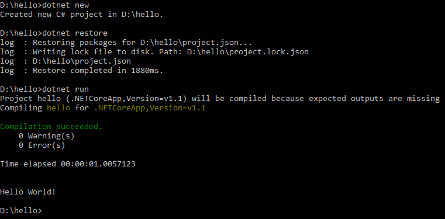
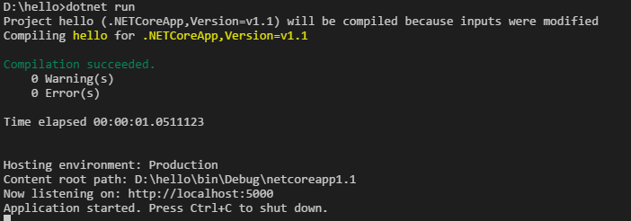
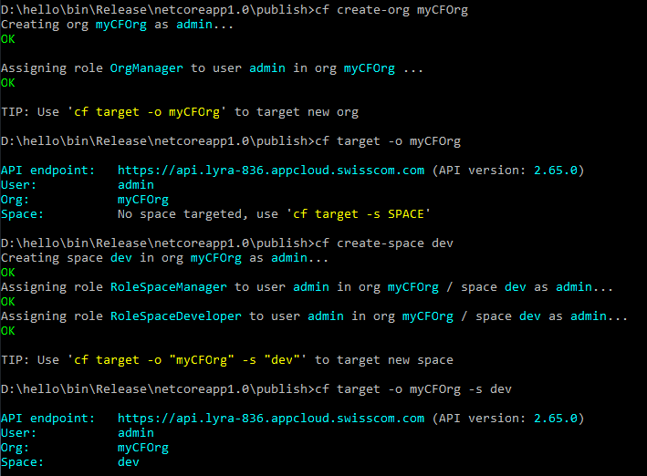
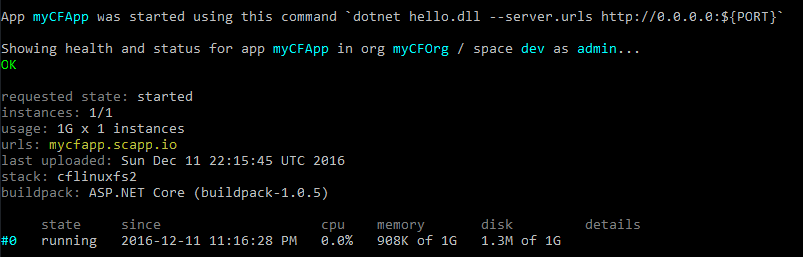
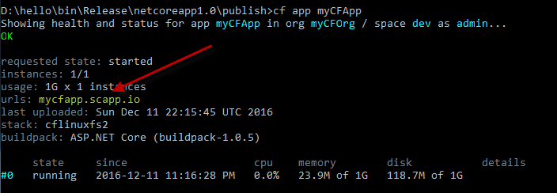
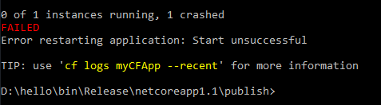
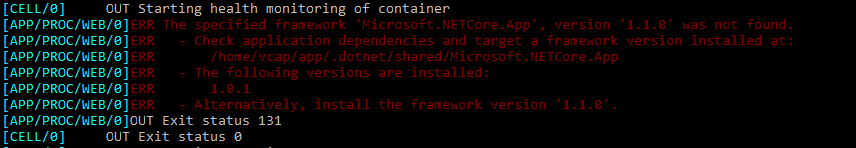

# First steps with .NET Core on a Cloud Foundry platform

<br>
<br>

This blog post gives you an introduction to .NET Core and how you can deploy a .NET Core application to Cloud Foundry from scratch.

The latest version of .NET Core, 1.1.0, was released on November 16th 2016 ([Announcement](https://blogs.msdn.microsoft.com/dotnet/2016/11/16/announcing-net-core-1-1/)) and
brings some improvements across .NET Core, ASP.NET Core and EF Core that will make your apps better and faster.

.NET Core is cross-platform, supporting Windows, OS X and Linux, and can be used in device, cloud, and embedded/IoT scenarios ([.NET Core Guide](https://docs.microsoft.com/en-us/dotnet/articles/core/index)).

As .NET Core now supports Linux, it is possible to run apps in a Cloud Foundry Ubuntu container. For that, you build your .NET Core app and deploy it with the [.NET Core buildpack](https://github.com/cloudfoundry/dotnet-core-buildpack) to Cloud Foundry.
Your app has to be cloud-ready ([Considerations for Designing and Running an Application in the Cloud](https://docs.developer.swisscom.com/devguide/deploy-apps/prepare-to-deploy.html))

Currently, the LTS version of .NET Core is 1.0.1 and the latest version is 1.1.0. We will use both in our examples.
As a source code editor we use Visual Studio Code as it can be used on different plattforms like Windows, Linux and OS X.

To get started, you have to:

1. Install .NET Core SDK
1. Install Visual Studio Code
1. Setup an account on a Cloud Foundry platform
1. Install the [Cloud Foundry CLI](https://docs.cloudfoundry.org/cf-cli/install-go-cli.html)
1. Write some code
1. Deploy the app to Cloud Foundry

<br>

## 1. Install the .Net Core SDK


An installation guide can be found here: <https://www.microsoft.com/net/core>

Please install the .NET Core 1.1 SDK so you are able to build apps for 1.1.0 and 1.0.1 .
The SDK can be found on <https://www.microsoft.com/net/download/core#/current>. Download and install the SDK that fits your OS.

<br>

## 2. Install Visual Studio Code

Visual Studio Code is a cross-platform source code editor. You can use it on Windows, Linux and OS X. It supports debugging, git control, syntax highlithing,  intelligent code completion, snippets, and code refactoring. It's free and open source. You can use it also for additional languages by installing extensions.
If you are used to working with other source code editors or IDEs (like Visual Studio or IntelliJ) with support for .NET Core you don't have to switch.

Visual Studio Code is available on <https://code.visualstudio.com/Download>

C# language support is an optional install from the Marketplace. You can install it from within Visual Studio Code ([Installing C# support](https://code.visualstudio.com/Docs/languages/csharp#_installing-c35-support)).   

To get familiar with it check out the following links:

* [.NET Core and Visual Studio Code](https://code.visualstudio.com/docs/runtimes/dotnet)
* [Basics](https://code.visualstudio.com/docs/editor/codebasics)
* [Working with c#](https://code.visualstudio.com/docs/languages/csharp)
* [Editing Evolved](https://code.visualstudio.com/docs/editor/editingevolved)

<br>

### Configure Visual Studio Code

Maybe you are working behind a corporate proxy. In this case you have to set the proxy settings in Visual Studio Code.
You can do that by modifying the `settings.json` file under the menu item "File/Preferences/User Settings":

```json
{
  "http.proxyStrictSSL": false,
  "http.proxy": "http://proxy.example.com:8080",
  "https.proxy":"http://proxy.example.com:8080"
}
```

<br>

## 3. Set up an account on a Cloud Foundry platform

Choose your prefered Cloud Foundry provider and sign up for an account.

You can find a list of certified Cloud Foundry Providers on <https://www.cloudfoundry.org/use/cloud-foundry-certified>.
If you choose one of these providers you are certain that your app will run as expected and you could also switch the provider later and your app will still work.

For example, you can sign up for the [Swisscom Application Cloud](https://developer.swisscom.com/).
To start using it, here's the link to the [documentation](https://docs.developer.swisscom.com/).

<br>

## 4. Install the Cloud Foundry CLI

Follow the [instructions](https://docs.cloudfoundry.org/cf-cli/install-go-cli.html) to install the CLI.

<br>


## 5. Write some Code

* First we will set up a new .NET Core "hello world" console application.
* Then we will turn it into a web application and also into a MVC API application.
* Afterwards, we will prepare it to use the Cloud Foundry buildpack.

<br>

### Set up a .NET console application

To create a new project, open a new console/terminal and follow these steps:

1. Create a new folder/directory
1. Change to the folder
1. Run `dotnet new` to create a new project
1. Run `dotnet restore` to fetch all required NuGet packages linked in the project
1. Run `dotnet run` to execute the app

```shell
$ mkdir hello
$ cd hello
$ dotnet new
$ dotnet restore
$ dotnet run
```

and you will get "Hello World!" in the output:



Now we open the "hello" project with Visual Studio Code (or your editor of choice) and we modify it to become a web application.

* In Visual Studio Code, under the menu item "File/Open Folder..." select the "hello" folder and open it.
* Confirm all messages from Visual Studio Code.
* Open the `Project.cs` file.

The source code:

```c#
using System;

namespace ConsoleApplication
{
    public class Program
    {
        public static void Main(string[] args)
        {
            Console.WriteLine("Hello World!");
        }
    }
}
```

The file contains a `public Main()` function, just like you expect for a classic console application. All .NET Core applications, including ASP.NET applications, are now console applications.

<br>

### Turn it into a web application

To turn the app into an ASP.Net web application, we have to add a self-hosted web server.
Currently, for cross-platform applications, we have to use the [Kestrel](https://github.com/aspnet/KestrelHttpServer) server.

> Starting with version 1.1 Preview 1, on Windows you can also use WebListener as a web server.
> WebListener gives you the option to take advantage of Windows specific features.

For now, we want to build an application with version 1.0.1.
Therefore, we change the references in `project.json` to use version `1.0.1`.
We will switch to `1.1.0` later in this blog post.

For that we have to:

* Add some namespaces:

  ```c#
  using Microsoft.AspNetCore.Builder;
  using Microsoft.AspNetCore.Hosting;
  using Microsoft.AspNetCore.Http;
  ```

* Modify the `Main()` method to use the Kestrel web server:

  ```c#
  var host = new WebHostBuilder()
      .UseKestrel()
      .UseStartup<Startup>()
      .Build();

  host.Run();
  ```

* Add an additional class `Startup` with a `Configure()` method in it:

  ```c#
  public class Startup
  {
      public void Configure(IApplicationBuilder app)
      {
          app.Run(async (context) =>
          {
              await context.Response.WriteAsync("Hello World!");
          });
      }
  }
  ```

* Add a reference in the `project.json` to pull in the Kestrel web server and HTTP extensions:

  ```json
  "dependencies": {
      "Microsoft.AspNetCore.Server.Kestrel": "1.0.1"
    },
  ```

* Change all references to `1.0.1` and the framework version to `netcoreapp1.0`.

The whole modified Program.cs file:

```c#
using System;
using Microsoft.AspNetCore.Builder;
using Microsoft.AspNetCore.Hosting;
using Microsoft.AspNetCore.Http;

namespace ConsoleApplication
{
    public class Program
    {
        public static void Main(string[] args)
        {
            var host = new WebHostBuilder()
                .UseKestrel()
                .UseStartup<Startup>()
                .Build();

            host.Run();
        }
    }

    public class Startup
    {
        public void Configure(IApplicationBuilder app)
        {
            app.Run(async (context) =>
            {
                await context.Response.WriteAsync("Hello World!");
            });
        }
    }
}
```

The modified `Project.json` :

```json
{
  "version": "1.0.0-*",
  "buildOptions": {
    "debugType": "portable",
    "emitEntryPoint": true
  },
  "dependencies": {
    "Microsoft.AspNetCore.Server.Kestrel": "1.0.1"
  },
  "frameworks": {
    "netcoreapp1.0": {
      "dependencies": {
        "Microsoft.NETCore.App": {
          "type": "platform",
          "version": "1.0.1"
        }
      },
      "imports": "dnxcore50"
    }
  }
}
```

After we have made the change to the `project.json`, Visual Studio Code asks for restoring. Confirm the message.
You can do that also manually in your console/terminal or in the integrated terminal of Visual Studio Code (menu item "View/Integrated Terminal")
This updates the NuGet packages and pulls the additional package.

Then run either via console/terminal or the integrated terminal:

```shell
$ dotnet run
```

> You can also add an additional task in Visual Studio Code which you can call to run the app (see <https://code.visualstudio.com/docs/editor/tasks>)

If there are no exceptions, you will be informed that the web server is listening on port 5000:



Open <http://localhost:5000> and ... there it is!

#### Middleware

ASP.NET Core applications are self-contained console applications with an integrated web server.
The configuration is delegated to the `Startup` class. For simplicity, the class in this post is in the same file.
The `Startup` class is where you can hook up custom middleware that is added to the ASP.NET pipeline.
Middleware is essentially what we used to call "HttpHandlers" and "HttpModules" in classic ASP.NET.

#### App.Run()

The code in the Startup class above uses the `App.Run()` middleware handler,
which is roughly the equivalent of an HttpHandler in classic ASP.NET.
When `App.Run()` gets fired it is expected to handle inbound requests completely and return a result.


#### App.Use()

`App.Use()` is like an HttpModule in classic ASP.NET.
Handlers can be chained together and are fired in the order they are assigned.
Unlike HttpModules, middleware can handle both before and after request processing operations.

So you could add the following method just before the `App.Run()` method in our example:

```c#
app.Use(async (context, next) =>
{
    await context.Response.WriteAsync("Pre Processing...");

    await next();

    await context.Response.WriteAsync("...Post Processing");
});
```

And as a response, you would see:

```txt
Pre Processing...Hello World!...Post Processing
```

<br>

### Turn it into a MVC API application

`App.Use()` and `App.Run()` are very low level constructs.
When you build a web application you tend to use much higher abstractions such as [ASP.NET MVC](https://www.asp.net/mvc).

ASP.NET Core has built-in support for web APIs with an MVC architecture.
Unifying the two frameworks makes it simpler to build apps that include both UI (HTML) and APIs, because now they share the same code base and pipeline.

To turn the app into an MVC API application with a single simple API endpoint `HelloWorld`, we have to:

* Replace the `Microsoft.AspNetCore.Http` namespace with two other namespaces:

  ```c#
  using Microsoft.AspNetCore.Hosting;
  using Microsoft.AspNetCore.Builder;
  using Microsoft.Extensions.DependencyInjection;
  using Microsoft.AspNetCore.Mvc;
  ```

* Modify the `Configure()` method:

  ```c#
  public void Configure(IApplicationBuilder app)
  {
      app.UseMvc();
  }
  ```

* Add an additional method `ConfigureServices()` to the `Startup` class:

  ```c#
  public void ConfigureServices(IServiceCollection services)
  {
      services.AddMvc();
  }
  ```

* Add a `HelloWorld` controller class:

  ```c#
  [Route("[controller]")]
  public class HelloWorldController : Controller
  {
      [HttpGet]
      public string Index()
      {
          return "Hello World!";
      }
  }
  ```

* Add an additional reference to the `project.json` file:

  ```json
  "dependencies": {
    "Microsoft.AspNetCore.Mvc": "1.0.1"
  },
  ```

The whole modified `Program.cs` file:

```c#
using Microsoft.AspNetCore.Hosting;
using Microsoft.AspNetCore.Builder;
using Microsoft.Extensions.DependencyInjection;
using Microsoft.AspNetCore.Mvc;

namespace MyApplication
{
    public class Program
    {
        public static void Main(string[] args)
        {
            var host = new WebHostBuilder()
                .UseKestrel()
                .UseStartup<Startup>()
                .Build();

            host.Run();
        }
    }

   [Route("[controller]")]
   public class HelloWorldController : Controller
   {
       [HttpGet]
        public string Index()
        {
            return "Hello World!";
        }
   }


    public class Startup
    {
        public void ConfigureServices(IServiceCollection services)
        {
            services.AddMvc();
        }

        public void Configure(IApplicationBuilder app)
        {
            app.UseMvc();
        }
    }
}
```

This code sets up the required dependency injection in ConfigureServices() and then enables MVC for the application in Configure().

The modified `Project.json` :

```json
{
  "version": "1.0.0-*",
  "buildOptions": {
    "debugType": "portable",
    "emitEntryPoint": true
  },
  "dependencies": {
    "Microsoft.AspNetCore.Mvc": "1.0.1",
    "Microsoft.AspNetCore.Server.Kestrel": "1.0.1"
  },
  "frameworks": {
    "netcoreapp1.0": {
      "dependencies": {
        "Microsoft.NETCore.App": {
          "type": "platform",
          "version": "1.0.1"
        }
      },
      "imports": "dnxcore50"
    }
  }
}
```

Restore and run the app. When calling `http://localhost:5000/helloWorld` you get "Hello World!" as a response.

<br>

### Preparation for Cloud Foundry

An MVC API application is deployed to Cloud Foundry by using the .NET Core buildpack. You can imagine a buildpack as instructions to set up the runtime environment of your application.

Roughly, the following steps are involved during the staging process:

* Creating the app (if not already done)
* Creating a route and binding it to the app (if not already done)
* A temporary container (Ubuntu) is created
* The application bits are uploaded to the container
* The buildpack itself is downloaded to the container
* The buildpack is executed:
  * It downloads additional dependencies (runtimes, frameworks, web servers)
  * It installs and configures all the necessary components
* The whole setup is stored in a so-called droplet and the droplet is saved
* The temorary container is destroyed
* Starting the application in one ore more running containers
  * The droplet is restored to the containers
  * The app is started

Cloud Foundry will automatically assign each application instance an IP address and port.
Each instance of your app may receive a different IP address and port.
The .NET Core buildpack configures the app web server automatically so you don't have to handle this yourself.
But you have to prepare your app in a way that allows the buildpack to deliver this information via the command line to your app.

Cloud Foundry will start your app with the following command: `dotnet run --server.urls http://0.0.0.0:${PORT}`

For that we have to:

* Add an additional namespace:

  ```c#
  using Microsoft.Extensions.Configuration;
  ```

* Modify the Main() method:

  ```c#
  var config = new ConfigurationBuilder()
      .AddCommandLine(args)
      .Build();

  var host = new WebHostBuilder()
      .UseKestrel()
      .UseConfiguration(config)
      .UseStartup<Startup>()
      .Build();
  ```

* Add an additional reference to `project.json` (as there is no `1.0.1` version for CommandLine so we use `1.0.0` instead):

  ```c#
  "Microsoft.Extensions.Configuration.CommandLine": "1.0.0",
  ```

Restore the project and run the application on a different port than 5000 (default port):

```shell
$ dotnet restore
$ dotnet run --server.urls http://localhost:5001
```

Your application endpoint should now be available on port 5001.

<br>

## 6. Deployment to Cloud Foundry

Cloud Foundry automatically uses the .NET Core buildpack when:

1. The pushed app contains one or more `project.json` files.
1. The app is pushed from the output directory of the dotnet publish command.

Currently, the buildpack has an issue for option 1: The app is compiled just before starting (running container) instead of during the staging phase.

Therefore, most likely, the build process needs more memory than your app needs at runtime and you need to configure your Cloud Foundry app with more memory.
Secondly, the NuGet cache is also stored in your container and uses several hundred megabytes disk space.
This issue will be fixed by the buildpack developers as soon as Microsoft has switched from `project.json` to MSBuild projects.

For now, it's better to go with option 2 as it has a lower footprint.

Steps to deploy the application to Cloud Foundry:

1. Publish the application with the `dotnet publish` command and use the option `Release`
1. Go to the `bin/Release/netcoreapp1.0/publish` folder
1. Log in to Cloud Foundry with the CF CLI
1. Deploy the app to Cloud Foundry

<br>

### Publish the application with `dotnet publish` and go to the publish folder

```shell
$ dotnet publish -c Release
$ cd bin/Release/netcoreapp1.0/publish
```

<br>

### Log in to Cloud Foundry

Get your credentials (API-endpoint, user, password) from your Cloud Foundry provider and log in.
For example, if you are using the Swisscom Application Cloud:

```shell
$ cf login -a https://api.lyra-836.appcloud.swisscom.com -u myUserName
```

(you will be asked for your password during the login process)

If you are behind a corporate proxy you have to configure the proxy first:

Windows:

```shell
$ set http_proxy=proxy.example.com:8080
$ set https_proxy=proxy.example.com:8080
```

Linux:

```shell
$ export http_proxy=proxy.example.com:8080
$ export https_proxy=proxy.example.com:8080
```

<br>

### Deploy the app to Cloud Foundry

If not already done, create an org and a space and then target the space:

```shell
$ cf create-org myCFOrg
$ cf target -o myCFOrg
$ cf create-space dev
$ cf target -s dev
```



Finally, deploy the app:

```shell
$ cf push myCFApp
```



Cloud Foundry has automatically used the .NET Core Buildpack as we have pushed the app from the `publish` folder.

If everything went well, you can call your app using its route's URL. You can retrieve that URL using the `cf app` command:

```shell
$ cf app myCFApp
```



In my example the URL is `mycfapp.scapp.io`. As you can see, the memory and disk usage is relatively small. With option 1 it would be much higher.

Then open the URL <http://mycfapp.scapp.io/HelloWorld>. Et voilà!

<br>

### Deploy the app with version `1.1.0`

To do that, we modify the references and the framework version in `project.json`:

```json
{
  "version": "1.0.0-*",
  "buildOptions": {
    "debugType": "portable",
    "emitEntryPoint": true
  },
  "dependencies": {
    "Microsoft.AspNetCore.Mvc": "1.1.0",
    "Microsoft.AspNetCore.Server.Kestrel": "1.1.0",
    "Microsoft.Extensions.Configuration.CommandLine": "1.1.0"
  },
  "frameworks": {
    "netcoreapp1.1": {
      "dependencies": {
        "Microsoft.NETCore.App": {
          "type": "platform",
          "version": "1.1.0"
        }
      },
      "imports": "dnxcore50"
    }
  }
}
```

We also have to add a `global.json` file and add some content to it. Otherwise, the buildpack will use an older version of .NET CLI to run the app:

```json
{
  "sdk": {
    "version": "1.0.0-preview2-1-003177"
  }
}
```

>This is the SDK version and not the framework version.

Publish again and go to the version 1.1 publish folder:

```shell
$ dotnet publish -c Release
$ cd bin/Release/netcoreapp1.1/publish
```

Deploy the app:

```shell
$ cf push myCFApp
```

... and it has failed!



Let's look at the logs:

```shell
$ cf logs myCFApp --recent
```



It indicates that framework version 1.1.0 was not found.

By default, the system buildpack is used. The system buildpack is updated with Cloud Foundry.
In the current installed Cloud Foundry version the latest .NET framework 1.1.0 is not included.
This will be fixed by one of the next releases.
The online version of the buildpack is able to use the latest framework version by downloading it.

This behaviour can occur anytime if you are using the latest version of .NET Core. Therefore, we deploy our app with the online buildpack:

```shell
$ cf push myCFApp -b https://github.com/cloudfoundry/dotnet-core-buildpack
```

This time, everything went well!

<br>

## Further readings

* [Swisscom Application Cloud: .NET Core Tutorial](https://docs.developer.swisscom.com/tutorial-dotnetcore/)
* [Swisscom Application Cloud: .NET Core Buildpack](https://docs.developer.swisscom.com/buildpacks/dotnet-core/index.html)
* [Swisscom Application Cloud Webinar: Pushing .NET Apps to Cloud Foundry](https://youtu.be/7RTLJ5kxmw4)
* [Swisscom Application Cloud: Developer Documentation](https://docs.developer.swisscom.com/)
* [Rick Strahl's great Blog Post: Exploring .NET Core and ASP.NET Core](https://weblog.west-wind.com/posts/2016/Jun/29/First-Steps-Exploring-NET-Core-and-ASPNET-Core)
* [Matthew Jones Blog Post: The Startup.cs File in ASP.NET Core](https://www.exceptionnotfound.net/the-startup-file-in-asp-net-core-1-0-what-does-it-do/)
* [Microsoft: .NET Core Guide](https://docs.microsoft.com/en-us/dotnet/articles/core/)
* [Microsoft: .NET Core command-line interface tools](https://docs.microsoft.com/en-us/dotnet/articles/core/tools/)
* [Microsoft: .NET Core Tutorials](https://docs.microsoft.com/en-us/dotnet/articles/core/tutorials/)
* [Microsoft: Using MSBuild to build .NET Core projects](https://docs.microsoft.com/en-us/dotnet/articles/core/tutorials/target-dotnetcore-with-msbuild)
* [Microsoft: .NET Core Application Deployment](https://docs.microsoft.com/en-us/dotnet/articles/core/deploying/)
